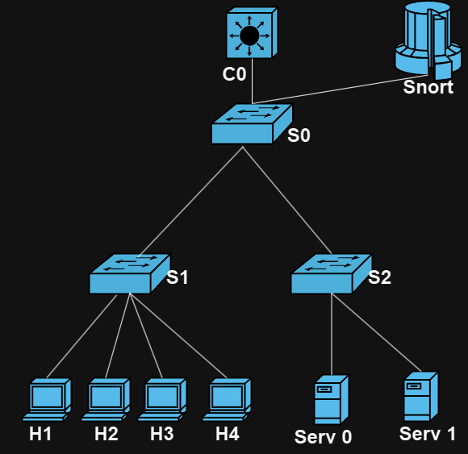

# Projekt - Sieci Sterowane Programowo

## Sterownik floodlight w zastosowaniu jako firewall współpracujący z aplikacją SNORT 

Celem projektu jest dostarczenie kompleksowego rozwiązania bezpieczeństwa sieciowego opartego na sterowniku Floodlight w roli firewalla, który efektywnie współpracuje z aplikacją SNORT. 

## Topologia Projektu

Powyższe zdjęcie przedstawia topologię projektu, ukazując główne komponenty systemu oraz ich wzajemne połączenia.

## Skrypty generujące ataki

### Slow Post
Do przeprowadzenia testowych ataków zostanie użyty skrypt generujący ataki Slow POST. Wykorzystane do tego będzie narzędzie slowhttptest dostępne pod linkiem https://www.kali.org/tools/slowhttptest/.

Poniżej linki do narzędzi generujących różnego rodzaju ataki. W zależności od działania danych skryptów/programów użyjemy jednego lub kilku z tej listy:
### SYN flood albo UDP flood:
http://www.hping.org/hping3.html 
https://www.hacking.pl/hping3/

### DNS flood:
https://charlesreid1.com/wiki/DoS/DNSSmurf
### LOIC TCP/UDP/HTTP flood : 
https://sourceforge.net/projects/loic/ 
### Różnego rodzaju ataki: 
https://sourceforge.net/p/netstressng/wiki/Home/

## Narzędzia generujące ruch sieciowy

### Iperf
https://iperf.fr/

### Open Traffic Generator
https://otg.dev/

### Trafgen - multithreaded network packet generator
https://man7.org/linux/man-pages/man8/trafgen.8.html

### PyTgen
https://github.com/reissmann/PyTgen

### PacketSender
https://github.com/dannagle/PacketSender

## Skład zespołu

1. **Hubert Majdański**
2. **Hubert Rydz**
3. **Hubert Talar**
4. **Krzysztof Uszko**
5. **Maciej Kasprzyk**

## Literatura

- Altameemi, Sarah & Jasim, Ammar. (2019). Evaluation of Firewall and Load balance in Fat-Tree Topology Based on Floodlight Controller. Indonesian Journal of Electrical Engineering and Computer Science. 17. 10.11591/ijeecs.v17.i3.pp1157-1164. 
- Jafarian, Tohid & Masdari, Mohammad & Ghaffari, Ali & Majidzadeh, Kambiz. (2020). Security anomaly detection in software-defined networking based on a prediction technique. International Journal of Communication Systems. 33. e4524. 10.1002/dac.4524.
- https://sddec18-07.sd.ece.iastate.edu/docs/Final%20Report.pdf  
- Huang, Nen-Fu & Wang, Chuang & Liao, I-Ju & Lin, Che-Wei & Kao, Chia-Nan. (2015). An OpenFlow-based collaborative intrusion prevention system for cloud networking. 85-92. 10.1109/ICCSN.2015.7296133. 
- S. V. Morzhov and M. A. Nikitinskiy, "Development and research of the PreFirewall network application for floodlight SDN controller," 2018 Moscow Workshop on Electronic and Networking Technologies (MWENT), Moscow, Russia, 2018, pp. 1-4, doi: 10.1109/MWENT.2018.8337255. 
